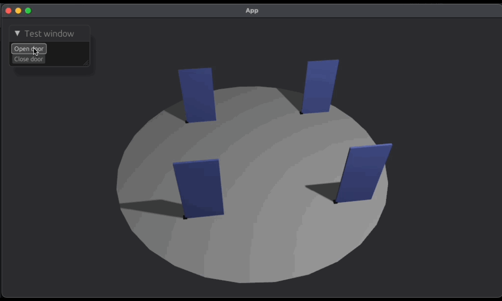
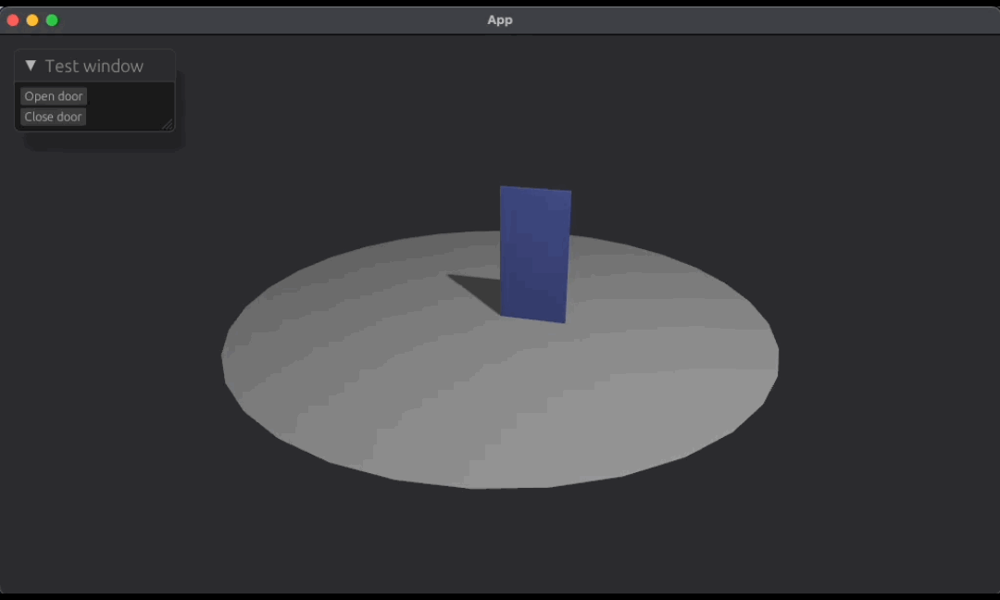

# bevy_infrastructure


This crate provides infrastructure entities that are interactive via Bevy events.

# Setup
The infrastructure plugin needs to be added to your application for the doors to spawn and be interactive.
```rust
add_plugins(BevyInfrastructurePlugin)
```

## Door configuration
To spawn a door in your world
```rust
commands.spawn(DoorBundle {
    door_properties: DoorProperties::new("door_1".to_string(), 1.5, DoorType::SingleSwinging),
    door_dimensions: DoorDimensions::new(1.0, 2.0, 0.05),
    transform: Transform::from_xyz(0.0, 0.0, 0.0),
    ..Default::default()
});
```

There are currently 4 different door types: `SingleSliding`, `DoubleSliding`, `SingleSwinging`, and `DoubleSwinging`.

The door's dimensions are defined as length, height, and thickness, respectively.

The transform is defined as the anchor point of the door, which is the lower corner.

# Interact
## Doors

For doors, there are 2 possible states, `open` and `close`.

```rust
fn open_door(mut door_request: EventWriter<DoorEvent>) {
    door_request.send(DoorEvent::open("door_1".to_string()));
}

fn close_door(mut door_request: EventWriter<DoorEvent>) {
    door_request.send(DoorEvent::close("door_1".to_string()));
}
```

# Examples
### Single swinging door


### Double swinging door


### Single sliding door


### Double sliding door
